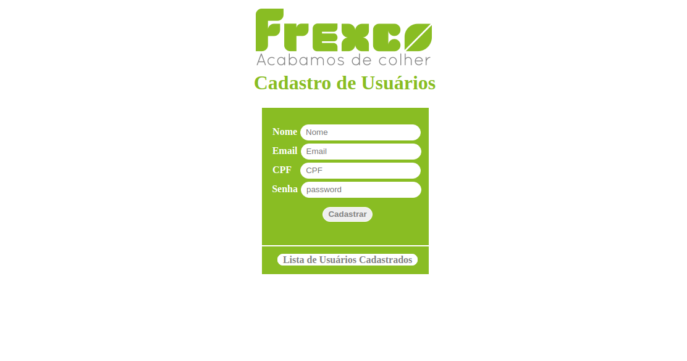
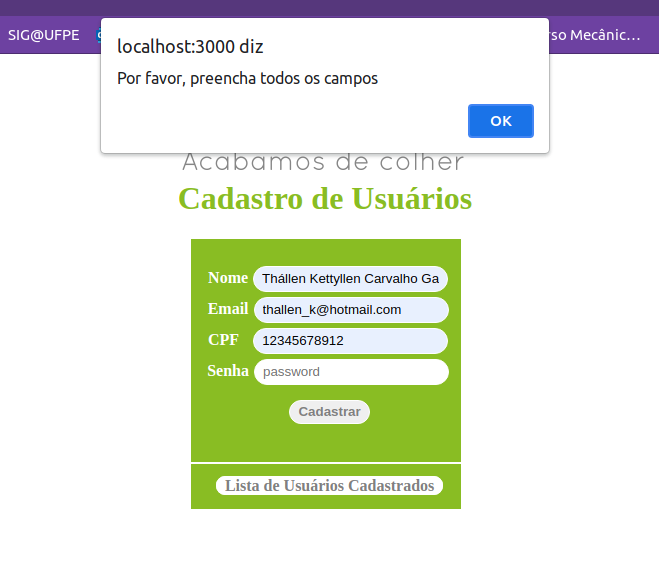
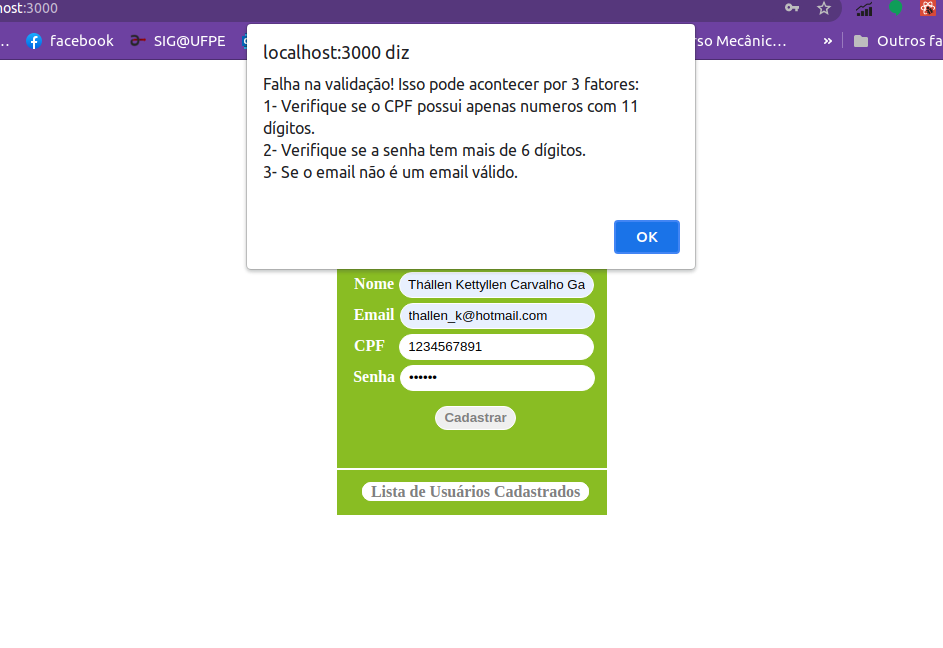
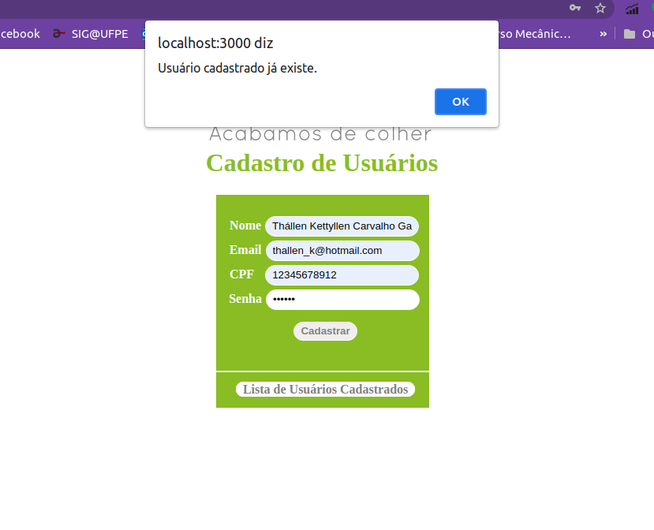
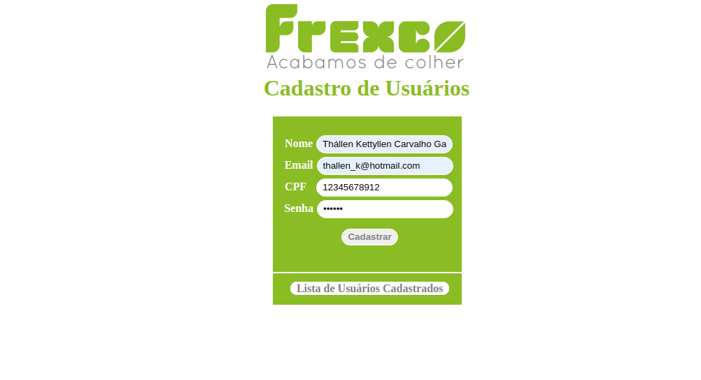
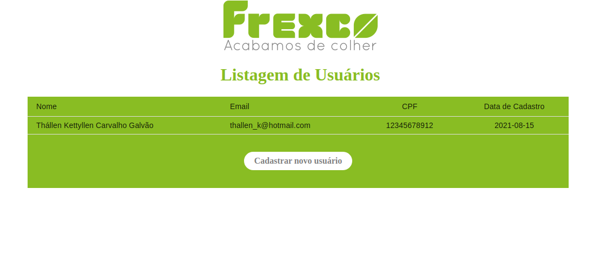
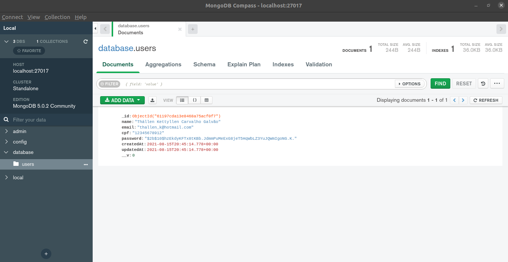
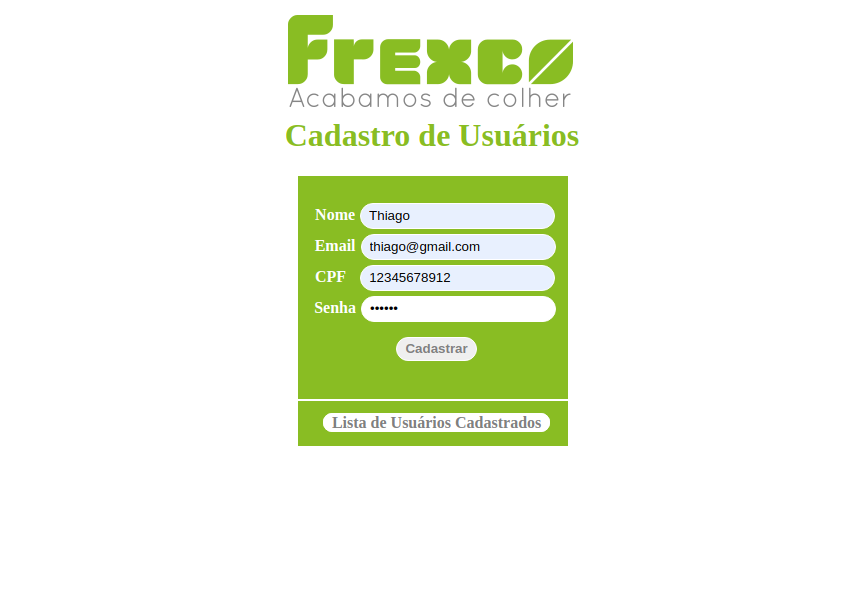
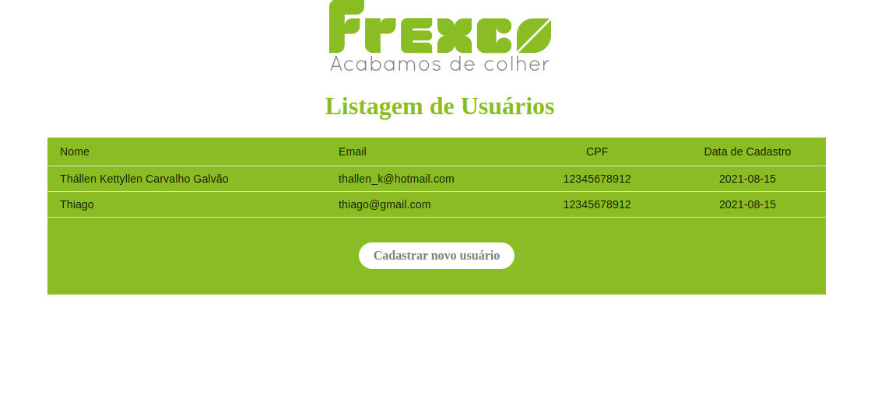
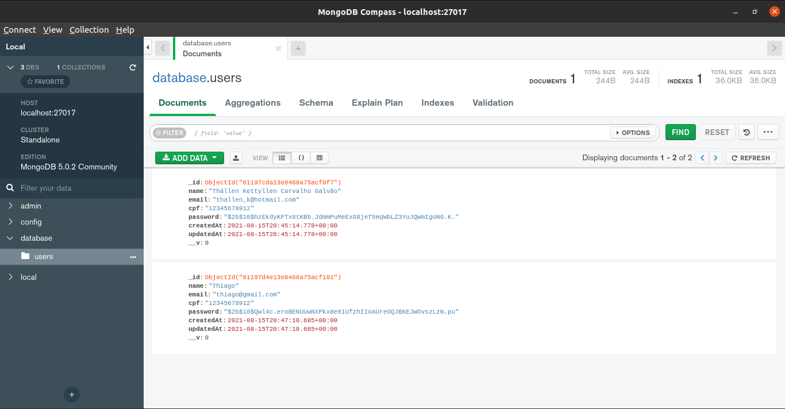

# Creating and listing users
The project consist on a interface for registering and listing users from a company using ReactJS for frontend interface and NodeJS for the backend. There are two pages, the first one is the register interface and the second one is the users list interface.

## Frontend Interface
The frontend interface was made by using the ReactJS and some dependencies from it.

### frontend dependecies:
- @material-ui/core: ^4.12.3,
- @testing-library/jest-dom: ^5.14.1,
- @testing-library/react: ^11.2.7,
- @testing-library/user-event: ^12.8.3,
- axios: ^0.21.1,
- react: ^17.0.2,
- react-dom: ^17.0.2,
- react-router-dom: ^5.2.0,
- react-scripts: 4.0.3,
- styled-components: ^5.3.0,
- web-vitals: ^1.1.2

The marckup language was made using JSX and the interface style was made using styled components.
The API request was made using the axios to make the get and post requisition in frontend.
The project frontend routes was made using the react-router-dom. The port is 3000.

## Backend project
The backend was made by using the NodeJS and some dependencies from it.

### backend dependecies:
- bcrypt: ^5.0.1,
- cookie-parser: ^1.4.5,
- cors": ^2.8.5,
- express: ^4.17.1,
- mongoose: ^5.13.7,
- nodemon: ^2.0.12,
- path: ^0.12.7,
- yup: ^0.32.9

The API was made using expressJS by creating the server on port 5000. To make the comunication with the database was used the mongoose. To make the project runing while changes were made I used the nodemon. To make the validation of the user register I used the lib yup. To make a hash in the password I used the bcrypt.

## stacks:
- MongoDB with mongoDB compass
- Reactjs
- Nodejs

## How to start the project 
You need to use the mongoDB compass to create a database called 'database' with a collection called 'users'. Before it, check if you have the mongoDB installed and running in your system. 

Once configured the database, you need to install all the dependencies into the project folder with the comand below:
To install with NPM: `npm i`

Once the dependencies installed, you can start all services:

To start in developer mode with NPM:  ` npm run dev `

## Pages

### User register
The home page consist in a forms with some inputs to make de user register.

It was made some validation with the register field:

1) If there are any field unfiled:

2) If there are any requirements not filed:
    - The CPF must have 11 caracters
    - The email must have a email structure
    - The password must have 6 or more caracters
    If you don't follow the rules above, an alert will appears

3) If your email have already been registered, an alert will appears:

Once you have followed all the register rules, you have to click on the button 'cadastrar'.

### Users list
By doing it, you're going to be redirected to the users list page:

As you can see on the mongoDB compass, the data you have just registerd are listed on the database

You can click on the button 'Cadastrar novo usuário' to be redirected to the register page again

You can also, click on the button 'Lista de Usuários Cadastrados' to be redirected to the users list page

As you can see again, on the mongoDB compass, both of the data are listed on the database, ensuring the data are being saved.

